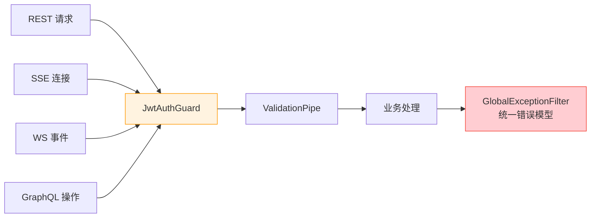

# 功能设计

Node.js 服务的功能围绕“传统后端的补充”定位展开，共五大能力模块：

| 模块 | 职责 | 对应传统后端的能力缺口 |
|------|------|----------------------|
| [WebSocket 实时通信](./websocket/README.md) | 长连接管理、事件订阅、实时推送、多实例广播 | 同步请求-响应模型无法维持海量长连接 |
| [SSE 实时推送](./sse/README.md) | 基于 HTTP 的服务端单向推送、事件流管理 | 低频单向推送无需引入完整 WebSocket 协议 |
| [GraphQL 聚合查询](./graphql/README.md) | 跨服务数据聚合、BFF 数据拼装、字段级批处理 | 多服务聚合编排成本高、接口爆炸 |
| [认证授权](./authentication/README.md) | JWT 校验、四类入口统一鉴权、权限判定 | 无缺口——与传统后端完全对齐 |
| [安全基线](./security/README.md) | 安全头、CORS、限流、参数校验、错误脱敏 | 无缺口——与传统后端完全对齐 |

## 设计原则

### 1. 只做擅长的事

凡涉及数据一致性的能力（写库、事务、令牌签发）一律归传统后端；Node.js 服务只承接连接态（WebSocket）与聚合（GraphQL）两类场景。新增功能前先对照 [能力边界](../getting-started/README.md#能力边界) 判断归属。

### 2. 鉴权与安全不打折

“补充”不等于“简化”。Node.js 服务与传统后端执行**同一套**安全基线：

- 同一来源的 JWT（共享密钥或 JWKS 公钥校验）
- 同一套业务错误码表
- 同样的安全头、CORS 白名单、限流策略与参数校验强度

### 3. 横切能力一次实现，四类入口复用

借助 NestJS 的 Guard / Pipe / Interceptor / Filter 在 HTTP、WebSocket、GraphQL 上下文通用的特性，认证、校验、日志、错误处理只实现一次（SSE 与普通 REST 同属 HTTP 上下文，天然复用）：

### 4. 无状态优先

Node.js 服务实例不持有业务状态：连接路由表存 Redis，限流计数存 Redis，广播经由 redis-adapter——任意实例可随时扩缩容、滚动重启，由网关层完成负载均衡。
