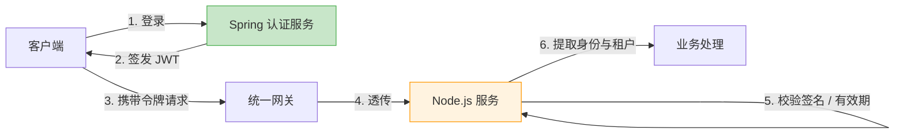

import Tabs from '@theme/Tabs';
import TabItem from '@theme/TabItem';

# 认证授权

认证授权与传统后端**完全对齐**：令牌由传统后端认证服务签发，Node.js 服务只做校验与权限判定，不签发、不刷新、不存储用户凭证。

## 模型



- **签发方唯一**：仅 Spring 认证服务可签发 JWT
- **校验方式**：对称算法（HS256）共享密钥，或非对称算法（RS256）由 Node.js 拉取公钥（JWKS）
- **令牌内容**：`sub`（用户 ID）、`tenantId`（租户）、`roles`（角色）、`exp`（过期时间）

:::warning
Node.js 服务**禁止**实现登录、注册、令牌刷新端点；认证入口统一在传统后端。
:::

## JWT 校验配置

```bash
pnpm add @nestjs/jwt
```

```ts
// infra/auth/auth.module.ts
import { JwtModule } from '@nestjs/jwt';

@Module({
  imports: [
    JwtModule.registerAsync({
      useFactory: (config: ConfigService) => ({
        // RS256 场景改为 jwksUri 拉取公钥
        secret: config.get<string>('JWT_SECRET'),
        signOptions: { expiresIn: '2h' },
      }),
      inject: [ConfigService],
    }),
  ],
  providers: [AuthService],
  exports: [AuthService],
})
export class AuthModule {}
```

```ts
// infra/auth/auth.service.ts
@Injectable()
export class AuthService {
  constructor(private readonly jwtService: JwtService) {}

  async verifyToken(token: string): Promise<AuthPayload> {
    try {
      return await this.jwtService.verifyAsync<AuthPayload>(token);
    } catch {
      throw new UnauthorizedException({ code: 40101, message: '令牌无效或已过期' });
    }
  }
}
```

## 四类入口统一鉴权

同一套 Guard 逻辑适配 HTTP、WebSocket、GraphQL 三种上下文（REST 与 SSE 同属 HTTP 上下文，共四类入口），通过 `GqlExecutionContext` 与 `WsExecutionContext` 提取令牌：

<Tabs>
  <TabItem value="guard" label="统一 Guard">

```ts
// common/guards/jwt-auth.guard.ts
@Injectable()
export class JwtAuthGuard implements CanActivate {
  constructor(private readonly authService: AuthService) {}

  async canActivate(context: ExecutionContext): Promise<boolean> {
    const request = this.getRequest(context);
    const token = this.extractToken(request, context);
    if (!token) throw new UnauthorizedException({ code: 40102, message: '缺少令牌' });

    const payload = await this.authService.verifyToken(token);
    request.user = payload; // 注入身份，后续直接取用
    return true;
  }

  private getRequest(context: ExecutionContext) {
    const type = context.getType<'http' | 'ws' | 'graphql'>();
    if (type === 'graphql') return GqlExecutionContext.create(context).getContext().req;
    if (type === 'ws') return context.switchToWs().getClient();
    return context.switchToHttp().getRequest();
  }

  private extractToken(request: any, context: ExecutionContext): string | undefined {
    const type = context.getType<'http' | 'ws' | 'graphql'>();
    if (type === 'ws') return request.handshake?.auth?.token;
    const header = request.headers?.authorization;
    return header?.startsWith('Bearer ') ? header.slice(7) : undefined;
  }
}
```

  </TabItem>
  <TabItem value="register" label="全局注册">

```ts
// app.module.ts
@Module({
  providers: [
    { provide: APP_GUARD, useClass: JwtAuthGuard },
  ],
})
export class AppModule {}
```

全局注册后，所有 REST 端点、WS 事件、GraphQL 查询默认受保护；公开端点用自定义装饰器豁免：

```ts
// common/decorators/public.decorator.ts
export const IS_PUBLIC_KEY = 'isPublic';
export const Public = () => SetMetadata(IS_PUBLIC_KEY, true);

// 在 Guard 开头判断
const isPublic = this.reflector.getAllAndOverride<boolean>(IS_PUBLIC_KEY, [
  context.getHandler(),
  context.getClass(),
]);
if (isPublic) return true;
```

  </TabItem>
  <TabItem value="usage" label="身份取用">

```ts
// common/decorators/current-user.decorator.ts
export const CurrentUser = createParamDecorator(
  (data: keyof AuthPayload, context: ExecutionContext) => {
    const type = context.getType<'http' | 'ws' | 'graphql'>();
    if (type === 'graphql') {
      return GqlExecutionContext.create(context).getContext().req.user;
    }
    if (type === 'ws') return context.switchToWs().getClient().data.user;
    return context.switchToHttp().getRequest().user;
  },
);

// Resolver / Controller / Gateway 中统一用法
@Query(() => Dashboard)
dashboard(@CurrentUser() user: AuthPayload) { ... }

@SubscribeMessage('notification:subscribe')
handle(@CurrentUser() user: AuthPayload) { ... }
```

  </TabItem>
</Tabs>

## 权限判定

角色与数据权限在 JWT payload 中声明，Node.js 服务只做**消费方**判定：

```ts
// common/guards/roles.guard.ts
@Injectable()
export class RolesGuard implements CanActivate {
  constructor(private readonly reflector: Reflector) {}

  canActivate(context: ExecutionContext): boolean {
    const required = this.reflector.getAllAndOverride<Role[]>(ROLES_KEY, [
      context.getHandler(),
      context.getClass(),
    ]);
    if (!required) return true;
    const { user } = this.getRequest(context);
    return required.some((role) => user.roles?.includes(role));
  }
}
```

- 角色定义与分配归传统后端，Node.js 不维护角色表
- 数据级权限（如“仅本租户”）在 service 层用 `tenantId` 过滤，不依赖前端传参

## WebSocket 连接续期

长连接场景下，令牌过期不强制断开，但敏感操作需重新校验：

- 连接建立时校验令牌（`handleConnection`）
- 连接期间，客户端在令牌过期前主动重连（`socket.disconnect().connect()`）并携带新令牌
- 服务端对敏感事件（如加入新租户房间）二次校验令牌有效期

:::tip[参见]
- [接口设计规范 · 鉴权约定](../../specification/api/README.md#鉴权约定)
- [WebSocket · 连接鉴权](../websocket/README.md#连接鉴权)
- [SSE · 客户端](../sse/README.md#客户端)（原生 EventSource 不支持请求头，需 `@microsoft/fetch-event-source` 传递令牌）
:::
