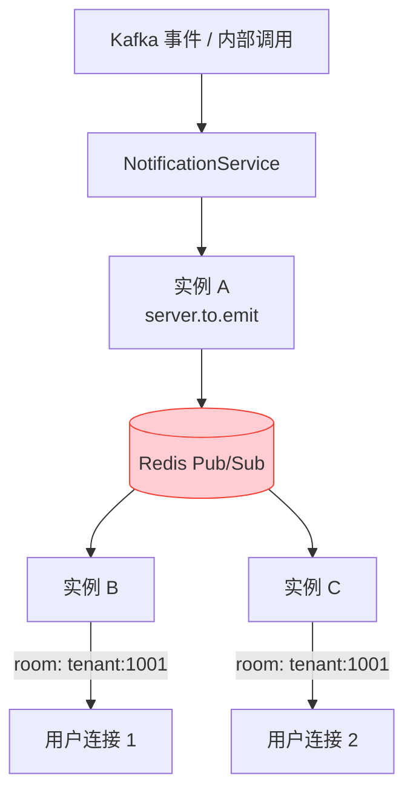
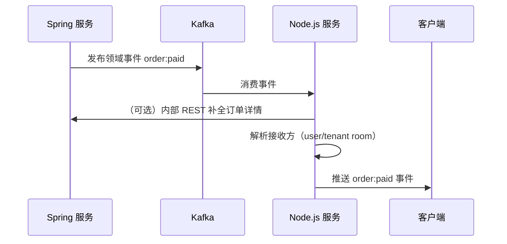

import Tabs from '@theme/Tabs';
import TabItem from '@theme/TabItem';

# WebSocket 实时通信

WebSocket 是 Node.js 服务的核心职责：承接传统后端不擅长的海量长连接场景，为 Web / App / 小程序提供实时推送能力。

## 技术选型

| 方案 | 结论 | 理由 |
|------|------|------|
| **Socket.IO**（`@nestjs/platform-socket.io`） | ✔️ 采用 | 自动降级（WebSocket → 长轮询）、房间/命名空间、ack 机制、生态成熟 |
| 原生 `ws` | � 备选 | 更轻量，但需自行实现心跳、重连、房间管理 |
| 原生 WebSocket API | ❌ | 无降级与重连，移动端弱网环境体验差 |

```bash
pnpm add @nestjs/websockets @nestjs/platform-socket.io
```

## 网关定义

网关是 WebSocket 入口，按业务域划分，一个业务域一个网关：

```ts
// modules/notification/notification.gateway.ts
import {
  ConnectedSocket,
  MessageBody,
  SubscribeMessage,
  WebSocketGateway,
  WebSocketServer,
} from '@nestjs/websockets';
import { Server, Socket } from 'socket.io';

@WebSocketGateway({
  namespace: 'notification',
  cors: { origin: false }, // CORS 由全局统一配置，见安全基线
})
export class NotificationGateway {
  @WebSocketServer()
  server: Server;

  @SubscribeMessage('notification:subscribe')
  handleSubscribe(
    @MessageBody() data: SubscribeTopicDto,
    @ConnectedSocket() client: Socket,
  ) {
    // 返回值通过 ack 回传给客户端
    return { code: 0, message: 'ok', data: { topic: data.topic } };
  }
}
```

- 网关注册在所属模块的 `providers` 中（未被模块引用的网关不会实例化）
- 命名空间按业务域隔离（`/notification`、`/device`），避免单一命名空间事件爆炸
- `@WebSocketGateway()` 第二参数可透传任意 [Socket.IO Server 选项](https://socket.io/docs/v4/server-options/)

## 连接鉴权

令牌在握手阶段校验，非法连接立即断开。鉴权逻辑复用全局 JWT 能力，不单独造轮子：

```ts
// modules/notification/notification.gateway.ts
export class NotificationGateway implements OnGatewayConnection, OnGatewayDisconnect {
  constructor(private readonly authService: AuthService) {}

  async handleConnection(client: Socket): Promise<void> {
    try {
      const token = client.handshake.auth.token as string;
      const payload = await this.authService.verifyToken(token);
      // 用户身份写入 socket.data，后续事件直接取用
      client.data.userId = payload.sub;
      client.data.tenantId = payload.tenantId;
      await client.join(`tenant:${payload.tenantId}`);
    } catch {
      client.disconnect(true);
    }
  }

  handleDisconnect(client: Socket): void {
    // 清理在线状态（如 presence 记录）
  }
}
```

客户端连接：

```ts
import { io } from 'socket.io-client';

const socket = io('wss://api.example.com/notification', {
  auth: { token },
  transports: ['websocket'], // 内网/现代浏览器可跳过轮询降级
});
```

:::warning
- 令牌**禁止**通过 URL query 传递（会进入网关与代理的访问日志）
- 连接建立后令牌过期不强制踢线，但后续敏感事件需重新校验；长连接续期由客户端重连完成
:::

## 消息收发

<Tabs>
  <TabItem value="ack" label="单次响应（ack）">

```ts
@SubscribeMessage('notification:mark-read')
handleMarkRead(@MessageBody() data: MarkReadDto) {
  // 返回值自动作为 acknowledgement 发送，仅一次
  return { code: 0, message: 'ok', data: { id: data.id } };
}
```

```ts
// 客户端
socket.emit('notification:mark-read', { id: 123 }, (res) => {
  console.log(res.code); // 0
});
```

  </TabItem>
  <TabItem value="multi" label="多次响应（流）">

```ts
@SubscribeMessage('device:metrics')
handleMetrics(@MessageBody() data: MetricsQuery): Observable<WsResponse<Metric>> {
  return this.metricsService.stream(data.deviceId).pipe(
    map((metric) => ({ event: 'device:metrics', data: metric })),
  );
}
```

返回 `Observable` 时，流中每个元素都会作为一条同名事件推送给客户端，直到流完成。

  </TabItem>
  <TabItem value="broadcast" label="主动推送">

```ts
// service 中注入网关后，通过 server 主动推送
this.server.to(`tenant:${tenantId}`).emit('notification:created', {
  event: 'notification:created',
  data: payload,
  timestamp: Date.now(),
  traceId,
});
```

  </TabItem>
</Tabs>

## 房间与广播域

房间是推送的最小寻址单元，命名规则与订阅事件对齐：

| 房间名 | 覆盖范围 | 加入时机 |
|--------|---------|---------|
| `user:{userId}` | 单用户全端 | 连接建立时 |
| `tenant:{tenantId}` | 租户内全部用户 | 连接建立时 |
| `topic:{topic}` | 主题订阅者 | 客户端订阅事件后 |

- 加入/退出房间必须通过服务端方法执行，客户端不能直接声明房间
- 敏感房间（如 `tenant:`）加入前校验用户归属，禁止任意加入

## 多实例广播

单实例 `server.emit` 只能触达本实例连接。生产环境多实例部署时，必须接入 **Redis 适配器**，让广播跨实例生效：

```bash
pnpm add @socket.io/redis-adapter ioredis
```

```ts
// main.ts
import { IoAdapter } from '@nestjs/platform-socket.io';
import { createAdapter } from '@socket.io/redis-adapter';
import { createClient } from 'redis';

class RedisIoAdapter extends IoAdapter {
  private adapterConstructor: ReturnType<typeof createAdapter>;

  async connectToRedis(): Promise<void> {
    const pubClient = createClient({ url: process.env.REDIS_URL });
    const subClient = pubClient.duplicate();
    await Promise.all([pubClient.connect(), subClient.connect()]);
    this.adapterConstructor = createAdapter(pubClient, subClient);
  }

  createIOServer(port: number, options?: ServerOptions) {
    const server = super.createIOServer(port, options);
    server.adapter(this.adapterConstructor);
    return server;
  }
}

// bootstrap 中
const redisIoAdapter = new RedisIoAdapter(app);
await redisIoAdapter.connectToRedis();
app.useWebSocketAdapter(redisIoAdapter);
```



:::warning[配套要求：网关 / LB 必须开启 Sticky Session]
Redis Adapter 只解决“跨实例消息可达”，不解决“连接归属”。Socket.IO 握手由多次 HTTP 请求组成（polling → upgrade），若网关轮询分发，握手请求落到不同实例会直接失败。多实例部署时必须同时满足：

1. **网关 / 负载均衡 Sticky Session**：按客户端 IP 或 Cookie 将同一客户端固定到同一实例（K8s Service 配置 `sessionAffinity: ClientIP`，网关配置见 [网关接入 · WebSocket 路由要点](../../integration/gateway/README.md#websocket-路由要点)）
2. **Redis Adapter**：跨实例广播寻址（本节）
:::

:::tip
推送入口（`server.to(...).emit`）代码无需感知多实例——适配器层透明转发，业务代码与单实例写法一致。
:::

## 心跳与超时

Socket.IO 内置 ping/pong 心跳，生产环境按弱网环境调整：

```ts
@WebSocketGateway({
  pingInterval: 25000,   // 服务端 ping 间隔（默认 25000ms）
  pingTimeout: 20000,    // 等待 pong 超时（默认 20000ms）
  connectTimeout: 10000, // 握手超时
})
```

- 移动端建议 `pingInterval` ≤ 30s，避免运营商 NAT 会话老化断连
- 客户端实现指数退避重连（Socket.IO Client 默认支持），重连成功后重新订阅房间

## 与传统后端的协作时序

实时数据的权威来源仍是传统后端，Node.js 只做分发：



:::warning[边界红线]
- Node.js 服务**不接收**客户端的写操作指令直接落库；客户端的写请求走传统后端 REST，变更结果经 Kafka 事件回流为推送
- 离线消息不在 WebSocket 通道补发，归传统后端的站内信/APNs 通道
:::
