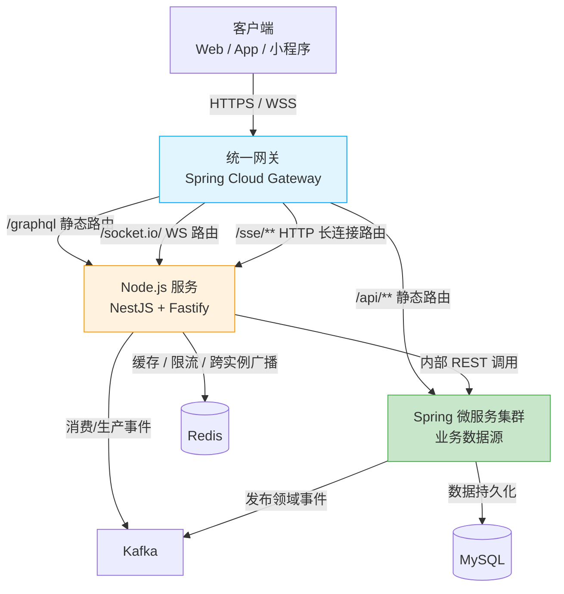
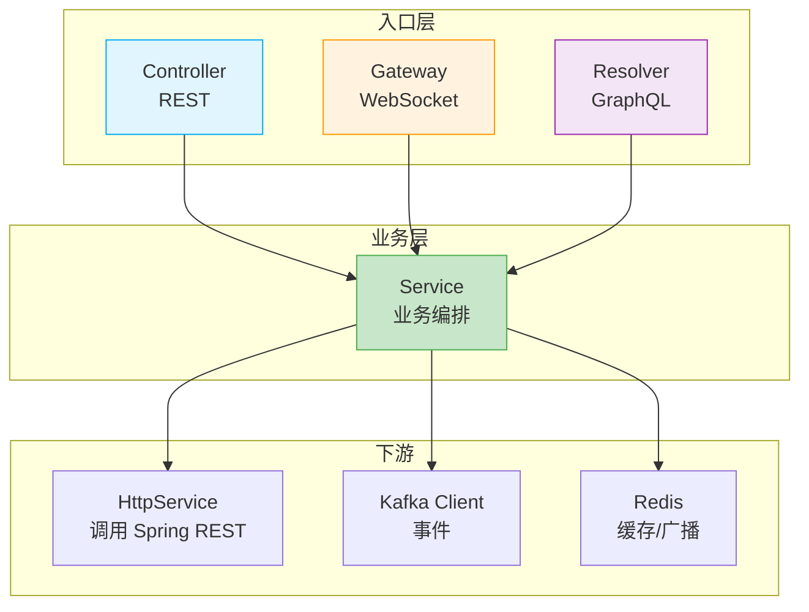

import Tabs from '@theme/Tabs';
import TabItem from '@theme/TabItem';

# 架构

:::tip
本文档面向“Node.js 作为传统后端补充”的服务端架构：Node.js 服务不取代 Spring、Laravel 等传统后端，而是承接其不擅长的实时通信与聚合查询场景，并融入既有微服务体系。
:::

## 定位：为什么是补充而非替代

传统后端（Spring、Laravel）建立在“请求-响应”同步模型之上，擅长业务 CRUD、事务一致性、权限体系与报表计算，是业务数据的**唯一可信来源（System of Record）**。但在以下场景中，同步模型与运行时特性会成为瓶颈：

- **海量长连接**：WebSocket 需要单实例维持数万连接，Java/PHP 的线程模型与内存开销成本高；Node.js 事件驱动 + 非阻塞 I/O 天然适合 I/O 密集的长连接场景
- **聚合查询（BFF）**：一个页面需要调用多个下游服务拼装数据，Node.js 的异步并发模型与 GraphQL 生态（Apollo）契合度高
- **实时消息编排**：站内信、订阅推送、事件广播等需要“连接态 + 事件流”的场景

因此 Node.js 服务的定位是：**承接传统后端不擅长的实时通信与聚合查询，共享同一套鉴权与安全基线，融入同一个微服务体系**。



**单向数据原则**：Node.js 服务**不直接读写业务数据库**，所有业务数据通过 Spring 服务的内部 REST API 获取；Node.js 只做聚合、转换与实时分发。业务写操作一律回到传统后端。

## 能力边界

| 场景 | 传统后端（Spring/Laravel） | Node.js 服务 |
|------|---------------------------|--------------|
| 业务 CRUD / 事务 / 数据持久化 | ✔️ 唯一数据源 | ❌ 不承接 |
| 用户体系 / 令牌签发 / 权限定义 | ✔️ | ❌ 仅校验令牌 |
| WebSocket 长连接 / 实时推送 | ❌ | ✔️ 核心职责 |
| SSE 服务端单向推送 | ⚠️ 可实现但长连接成本高 | ✔️ |
| 聚合查询（GraphQL BFF） | ⚠️ 可实现但编排成本高 | ✔️ 核心职责 |
| 事件驱动的通知编排 | ⚠️ | ✔️ |
| CPU 密集计算（报表 / 导出 / 图像处理） | ✔️ | ❌ 单线程事件循环不适用 |

:::warning[边界红线]
- Node.js 服务**不得签发认证令牌**，令牌统一由传统后端认证服务签发，Node.js 只做校验（共享密钥或 JWKS 公钥）
- Node.js 服务**不得直接连接业务数据库**进行写操作
- 新增能力前先判断归属：凡是涉及数据一致性的，归传统后端；凡是涉及连接态与聚合的，归 Node.js
:::

## 技术栈

| 类别 | 选型 |
|------|------|
| 运行时 | Node.js LTS（≥ 22） |
| 框架 | NestJS |
| HTTP 平台 | Fastify（`@nestjs/platform-fastify`） |
| WebSocket | Socket.IO（`@nestjs/platform-socket.io`） |
| SSE | NestJS 内置 `@Sse()`（`@nestjs/common`，无额外依赖） |
| GraphQL | Apollo Server（`@nestjs/apollo` + `@as-integrations/fastify`） |
| 语言 | TypeScript |
| 认证 | JWT（`@nestjs/jwt`，与传统后端同源密钥 / JWKS） |
| 参数校验 | class-validator + class-transformer |
| 安全头 | `@fastify/helmet` |
| 限流 | `@nestjs/throttler` |
| 缓存 / 广播 | Redis（ioredis + `@socket.io/redis-adapter`） |
| 消息队列 | Kafka（`@nestjs/microservices` / kafkajs） |
| 日志 | nestjs-pino（pino，Fastify 原生日志器） |
| 健康检查 | `@nestjs/terminus` |
| 单元测试 | Jest |
| 代码检查 | ESLint |
| 部署 | Docker |

## 分层结构

NestJS 以 **模块（Module）** 为组织单元，模块内按职责拆分控制器、服务、网关与解析器：

- `controller`：HTTP 端点，承载少量无法被 GraphQL 覆盖的 REST 端点（如健康检查、回调接收）与 SSE 推送端点（`@Sse()`）
- `gateway`：WebSocket 网关，管理连接生命周期、事件订阅与推送
- `resolver`：GraphQL 解析器，编排查询与字段级数据获取
- `service`：业务编排，调用下游 Spring 服务、读写缓存、发布事件
- `provider`：横切能力（Guard / Interceptor / Pipe / Filter），HTTP、WebSocket、GraphQL 三种上下文复用同一套（SSE 属 HTTP 上下文）



**单向依赖**：入口层（controller / gateway / resolver）→ service → 下游客户端，禁止反向引用；横切 provider 可作用于任意入口。

:::tip[NestJS 的核心收益]
Guard、Interceptor、Pipe、Exception Filter 等横切组件在 HTTP、WebSocket、Microservices 三种上下文中通用——同一套 JWT 校验 Guard 可同时保护 REST 端点、Socket.IO 事件与 GraphQL 查询，这是“保留传统后端一样的接口鉴权和安全”的框架基础。
:::

## 快速开始

### 初始化项目

```bash
pnpm add -g @nestjs/cli
nest new realtime-service --strict
cd realtime-service
```

### 启用 Fastify

```bash
pnpm add @nestjs/platform-fastify
```

```ts
// main.ts
import { NestFactory } from '@nestjs/core';
import {
  FastifyAdapter,
  NestFastifyApplication,
} from '@nestjs/platform-fastify';
import { AppModule } from './app.module';

async function bootstrap() {
  const app = await NestFactory.create<NestFastifyApplication>(
    AppModule,
    new FastifyAdapter(),
  );
  // 容器/网关环境必须监听 0.0.0.0，Fastify 默认仅监听 127.0.0.1
  await app.listen(process.env.PORT ?? 3000, '0.0.0.0');
}
bootstrap();
```

### 安装核心能力

```bash
# WebSocket（Socket.IO）
pnpm add @nestjs/websockets @nestjs/platform-socket.io

# SSE：NestJS 内置 @Sse()，无需额外依赖

# GraphQL（Apollo Server + Fastify 集成）
pnpm add @nestjs/graphql @nestjs/apollo @apollo/server @as-integrations/fastify graphql

# 配置 / 认证 / 校验 / 限流
pnpm add @nestjs/config @nestjs/jwt class-validator class-transformer @nestjs/throttler
```

:::warning[Fastify 平台差异]
切换 Fastify 后，Nest 的 HTTP provider 变为 Fastify，**依赖 Express 的中间件与生态包不再可用**，需使用 Fastify 等价物：`helmet` → `@fastify/helmet`、`@apollo/server` → 搭配 `@as-integrations/fastify`、压缩 → `@fastify/compress`。
:::

## 技术运用

本节是技术栈总览。

### 环境

- **Node.js**：运行时，使用 Active LTS 版本（≥ 22）
- **pnpm**：依赖管理与脚本执行

### 基础技术

- **TypeScript**：为 JS 提供静态类型，NestJS 的依赖注入与装饰器元数据建立在 TS 之上
- **RxJS**：NestJS 内置的响应式编程库，用于事件流与异步编排

### 框架与驱动

| 包名 | 作用 |
|------|------|
| [@nestjs/core](https://docs.nestjs.com/) | Nest 核心：DI 容器、模块系统 |
| [@nestjs/platform-fastify](https://docs.nestjs.com/techniques/performance) | Fastify HTTP 适配器 |
| [@nestjs/websockets](https://docs.nestjs.com/websockets/gateways) + [@nestjs/platform-socket.io](https://docs.nestjs.com/websockets/gateways) | WebSocket 网关（Socket.IO 平台） |
| [@nestjs/graphql](https://docs.nestjs.com/graphql/quick-start) + [@nestjs/apollo](https://docs.nestjs.com/graphql/quick-start) | GraphQL 模块（Apollo 驱动） |
| [@apollo/server](https://www.apollographql.com/docs/apollo-server/) + [@as-integrations/fastify](https://github.com/apollo-server-integrations/apollo-server-integration-fastify) | Apollo Server 5 及其 Fastify 集成 |
| [@nestjs/microservices](https://docs.nestjs.com/microservices/basics) | 微服务传输层（Kafka 等） |

### 工具库

| 包名 | 作用 |
|------|------|
| [ioredis](https://github.com/redis/ioredis) | Redis 客户端（缓存、限流存储、Socket.IO 广播适配） |
| [@socket.io/redis-adapter](https://socket.io/docs/v4/redis-adapter/) | Socket.IO 多实例广播适配器 |
| [nestjs-pino](https://github.com/iamolegga/nestjs-pino) | 结构化日志（pino） |
| [dataloader](https://github.com/graphql/dataloader) | GraphQL N+1 查询批处理 |
| [dayjs](https://day.js.org/zh-CN/) | 轻量化时间/日期处理 |
