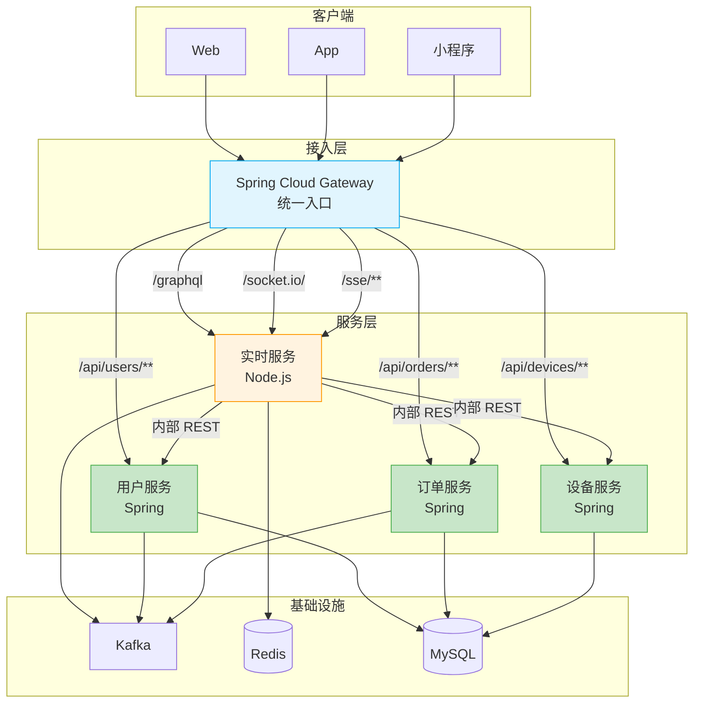

# 微服务集成

Node.js 服务不是独立后端，而是 Spring 微服务体系中的一个**能力节点**。本章说明如何在不改变现有 Spring 体系的前提下，将 Node.js 服务接入统一网关、统一认证、统一观测。

## 角色定位

- **接入层**：Spring Cloud Gateway 作为唯一入口，按路径静态路由到 Spring 服务或 Node.js 服务
- **服务层**：Node.js 服务与 Spring 服务平级，通过内部 REST 获取业务数据，不直接连库
- **基础设施**：Kafka 用于事件驱动，Redis 用于缓存与广播，MySQL 仅由 Spring 服务持有

## 集成要点

| 维度 | 方案 | 说明 |
|------|------|------|
| 入口统一 | 网关静态路由 | 客户端不感知后端技术栈 |
| 认证统一 | JWT 同源密钥 / JWKS | Node.js 只校验，不签发 |
| 数据获取 | 内部 REST（OpenFeign 风格） | 不引入服务发现，直连内部域名 |
| 事件驱动 | Kafka | Spring 发布领域事件，Node.js 消费后推送 |
| 缓存共享 | Redis | 会话、限流计数、广播适配 |
| 可观测性 | 日志 + 指标 + 追踪 | 与 Spring 服务同一套采集体系 |

:::warning[不引入额外复杂度]
- 不部署独立的 Node.js 服务注册中心（如 Consul），服务发现由网关静态配置完成
- 不引入 GraphQL Federation，Node.js 服务的 Schema 独立，不与其他 GraphQL 服务合并
- 不直接读写 MySQL，数据一致性由 Spring 服务保证
:::
