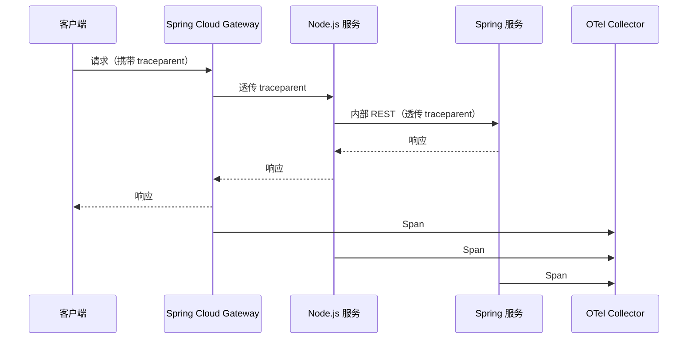

# 可观测性

Node.js 服务与 Spring 服务接入**同一套**观测体系：日志统一采集、指标统一汇聚、追踪统一串联，不额外建设独立监控栈。

## 结构化日志

使用 `nestjs-pino`（pino 是 Fastify 原生日志器，性能与生态最优）：

```bash
pnpm add nestjs-pino pino-http
```

```ts
// app.module.ts
@Module({
  imports: [
    LoggerModule.forRootAsync({
      useFactory: (config: ConfigService) => ({
        pinoHttp: {
          level: config.get('LOG_LEVEL', 'info'),
          // 生产环境输出 JSON，由 Fluent Bit / Filebeat 采集
          transport: process.env.NODE_ENV !== 'production'
            ? { target: 'pino-pretty' }
            : undefined,
          // 注入追踪 ID
          customProps: (req) => ({ traceId: req.id }),
          // 脱敏
          redact: ['req.headers.authorization', 'req.headers.cookie'],
        },
      }),
      inject: [ConfigService],
    }),
  ],
})
export class AppModule {}
```

**日志规范**：

| 场景 | 级别 | 必含字段 |
|------|------|---------|
| 请求入口 | `info` | `method`、`url`、`userId`、`tenantId`、`traceId` |
| 下游调用 | `debug` | `target`、`duration`、`status` |
| 业务异常 | `warn` | `code`、`message`、`traceId` |
| 系统异常 | `error` | `err.stack`、`traceId`（仅服务端可见） |
| WebSocket 连接 | `info` | `socketId`、`userId`、`namespace`、`room` |

:::warning
- 不打印完整令牌、密码、身份证号等敏感字段
- 高并发场景避免 `debug` 级别日志刷屏，采样率可配置
:::

## Prometheus 指标

使用 `@fastify/metrics`（Fastify 官方插件，基于 `prom-client`），与 Fastify 适配器原生集成，自动采集 HTTP 路由指标并暴露 `/metrics` 端点：

```bash
pnpm add @fastify/metrics prom-client
```

```ts
// main.ts
import metricsPlugin from '@fastify/metrics';

// NestFactory.create<NestFastifyApplication>(...) 之后、listen 之前
await app.register(metricsPlugin, {
  endpoint: '/metrics',
  defaultMetrics: { enabled: true }, // 进程级指标：CPU、内存、事件循环延迟
});
```

自定义业务指标通过 `prom-client` 默认注册表声明，由同一 `/metrics` 端点暴露：

```ts
// infra/metrics/metrics.service.ts
import { Counter, Histogram } from 'prom-client';

@Injectable()
export class MetricsService {
  readonly wsConnectionsTotal = new Counter({
    name: 'ws_connections_total',
    help: 'WebSocket 累计连接数',
    labelNames: ['namespace'],
  });

  readonly graphqlResolverDuration = new Histogram({
    name: 'graphql_resolver_duration_seconds',
    help: 'GraphQL Resolver 耗时',
    labelNames: ['resolver', 'field'],
    buckets: [0.01, 0.05, 0.1, 0.5, 1, 2],
  });
}
```

:::tip[为什么不选 @willsoto/nestjs-prometheus]
`@willsoto/nestjs-prometheus` 面向 Express 风格中间件设计，在 Fastify 适配器下自动 HTTP 指标采集存在兼容性缝隙；`@fastify/metrics` 直接挂钩 Fastify 生命周期（`onRequest`/`onResponse`），路由级指标零胶水代码。
:::

**核心指标清单**：

| 指标 | 类型 | 标签 | 用途 |
|------|------|------|------|
| `ws_connections_active` | Gauge | `namespace` | 当前活跃连接数 |
| `ws_messages_total` | Counter | `event`, `direction` | 消息吞吐量 |
| `graphql_resolver_duration_seconds` | Histogram | `resolver`, `field` | Resolver 性能 |
| `http_request_duration_seconds` | Histogram | `method`, `route`, `status` | REST 性能 |
| `kafka_consumer_lag` | Gauge | `topic`, `partition` | 消费延迟 |
| `redis_commands_total` | Counter | `command`, `status` | Redis 调用量 |

## 错误追踪（Sentry）

日志/指标/链路之外的第四支柱——**异常聚合**：未捕获异常自动上报，按堆栈指纹聚合，携带上下文与 release 版本，替代人肉捞日志。

```bash
pnpm add @sentry/nestjs @sentry/profiling-node
```

```ts
// src/instrument.ts —— 必须在应用任何代码之前加载
import * as Sentry from '@sentry/nestjs';
import { nodeProfilingIntegration } from '@sentry/profiling-node';

Sentry.init({
  dsn: process.env.SENTRY_DSN,
  environment: process.env.NODE_ENV,
  release: process.env.APP_VERSION, // CI 注入镜像 tag，错误回归可定位到具体发布
  integrations: [nodeProfilingIntegration()],
  tracesSampleRate: 0.1, // 与 OTel 采样率对齐
  profilesSampleRate: 0.1,
});
```

```ts
// main.ts 第一行
import './instrument';

// 全局异常过滤器：未捕获异常自动上报
app.useGlobalFilters(new SentryGlobalFilter()); // from '@sentry/nestjs/setup'
```

| 要点 | 说明 |
|------|------|
| 加载顺序 | `instrument.ts` 必须最先 `import`，否则自动插桩失效 |
| 业务异常降噪 | 预期内的 4xx `HttpException` 在过滤器中过滤，只上报 5xx |
| Sourcemap | CI 构建后经 `sentry-cli` 上传，堆栈还原为 TS 源码 |
| 与日志关系 | Pino 记全量流水，Sentry 聚合异常——互补，不替代 |

## OpenTelemetry 链路追踪

与 Spring 服务共用同一套 OpenTelemetry Collector，实现跨语言链路串联：

```bash
pnpm add @opentelemetry/sdk-node @opentelemetry/auto-instrumentations-node
```

```ts
// tracing.ts（在 main.ts 之前导入）
import { NodeSDK } from '@opentelemetry/sdk-node';
import { getNodeAutoInstrumentations } from '@opentelemetry/auto-instrumentations-node';
import { OTLPTraceExporter } from '@opentelemetry/exporter-trace-otlp-http';

const sdk = new NodeSDK({
  traceExporter: new OTLPTraceExporter({
    url: process.env.OTEL_EXPORTER_OTLP_ENDPOINT,
  }),
  instrumentations: [
    getNodeAutoInstrumentations({
      '@opentelemetry/instrumentation-fs': { enabled: false }, // 减少噪音
    }),
  ],
});
sdk.start();
```



- **Trace 上下文透传**：网关 → Node.js → Spring 通过 W3C `traceparent` Header 串联
- **Span 命名**：`{服务名}.{操作}`，如 `realtime-service.notification:subscribe`
- **采样策略**：网关层统一决策（头部采样），下游继承

## 健康检查

使用 `@nestjs/terminus` 暴露标准化健康检查：

```bash
pnpm add @nestjs/terminus
```

```ts
// modules/health/health.controller.ts
@Controller('api/health')
export class HealthController {
  constructor(
    private readonly health: HealthCheckService,
    private readonly redis: RedisHealthIndicator,
    private readonly kafka: KafkaHealthIndicator,
  ) {}

  @Get()
  @Public()
  liveness() {
    return { status: 'ok', timestamp: new Date().toISOString() };
  }

  @Get('ready')
  @Public()
  readiness() {
    return this.health.check([
      () => this.redis.pingCheck('redis', { timeout: 1000 }),
      () => this.kafka.pingCheck('kafka', { timeout: 1000 }),
    ]);
  }
}
```

| 探针 | 检查内容 | 失败动作 |
|------|---------|---------|
| 存活（Liveness） | 进程运行 | 重启容器 |
| 就绪（Readiness） | Redis、Kafka 连通 | 从负载均衡摘除 |

:::tip[告警建议]
- `ws_connections_active` 突降 50%：连接风暴或实例故障
- `graphql_resolver_duration_seconds` P99 > 2s：下游 Spring 服务响应恶化
- `kafka_consumer_lag` 持续增长：消费能力不足，需扩容
:::
