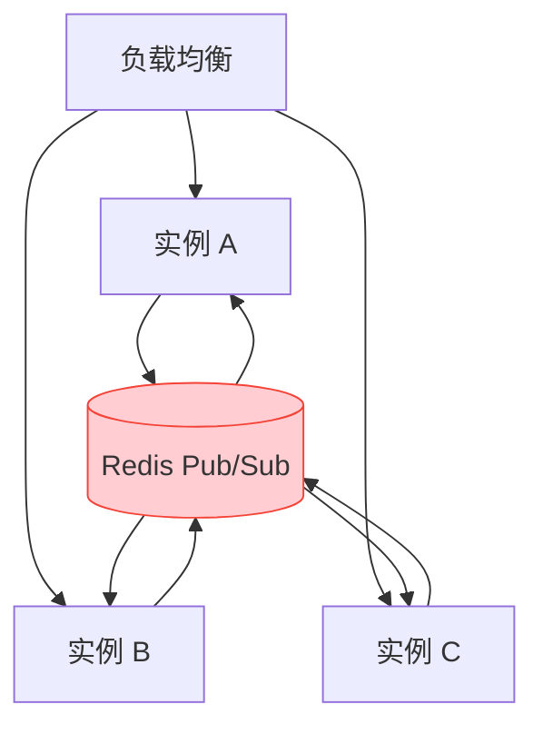

# 性能参考

## Fastify vs Express

NestJS 默认使用 Express，切换 Fastify 后核心收益：

| 指标 | Express | Fastify | 差异 |
|------|---------|---------|------|
| 吞吐量 (req/s) | ~15,000 | ~30,000 | ≈ 2 倍 |
| 平均延迟 | ~6.5ms | ~3.2ms | ≈ 50% 降低 |
| P99 延迟 | ~25ms | ~12ms | ≈ 52% 降低 |
| 内存占用 | 基准 | -10% ~ -15% | 更低 |

> 数据来自 Fastify 官方基准测试（Node.js 22，简单 JSON 响应）。实际业务场景差异取决于下游调用与序列化开销。

:::tip
WebSocket 与 GraphQL 场景下，HTTP 框架本身不是瓶颈；Fastify 的收益主要体现在 REST 兜底端点与健康检查的高并发响应。
:::

## WebSocket 长连接容量

单实例 Node.js 服务的理论容量（4C8G 容器）：

| 指标 | 数值 | 约束条件 |
|------|------|---------|
| 活跃连接数 | 10,000 - 50,000 | 消息频率低、心跳间隔 25s |
| 消息吞吐量 | 5,000 - 10,000 msg/s | 消息体 ≤ 1KB，无复杂序列化 |
| 内存占用/连接 | ~50KB | 含 Socket.IO 内部状态与缓冲区 |
| CPU 占用 | 60% - 70% | 消息编解码与房间匹配 |

**容量红线**：

- 单实例连接数 > 30,000 时，内存与事件循环延迟显著上升，建议水平扩展
- 消息体 > 10KB 或包含二进制数据时，吞吐量下降 50% 以上

## GraphQL 开销

GraphQL 的灵活性带来额外解析与校验成本：

| 场景 | 开销来源 | 优化 |
|------|---------|------|
| 查询解析 | Schema 校验、字段解析 | 启用 `validationRules` 缓存（Apollo 默认） |
| N+1 查询 | 字段级 Resolver 重复调用下游 | DataLoader 批处理 |
| 深度嵌套 | 递归解析与数据拼装 | `depthLimit(7)` 限制 |
| 大结果集 | 序列化与网络传输 | 分页 + 字段裁剪（客户端只取所需字段） |

**基准参考**（下游 Spring 服务 P99 = 50ms 时）：

| 查询类型 | P50 | P99 | 说明 |
|---------|-----|-----|------|
| 单字段查询 | 55ms | 120ms | 主要是网络往返 |
| 3 字段聚合 | 60ms | 150ms | 并行下游调用，无叠加 |
| 10 字段聚合（无 DataLoader） | 200ms | 800ms | N+1 导致延迟叠加 |
| 10 字段聚合（有 DataLoader） | 70ms | 180ms | 批处理显著改善 |

## 事件循环保护

Node.js 单线程事件循环是性能根基：**任何阻塞都会拖垮该实例上的全部连接**。

| 阻塞源 | 后果 | 处置 |
|--------|------|------|
| 同步 API（`readFileSync`/`execSync`） | 请求路径上全实例停顿 | 禁止出现在请求处理路径，仅允许启动初始化阶段 |
| CPU 密集计算（报表、导出、加解密批量） | 事件循环延迟飙升 | `worker_threads` 或甩回 Spring |
| 大 JSON 序列化（> 10MB） | 主线程长时间占用 | 分页 / 流式响应 |
| 正则回溯（ReDoS） | 实例被打挂 | 见 [安全规则 · 正则安全](../../specification/rule/security/README.md#正则安全) |

### CPU 密集任务：worker_threads

确需在 Node.js 侧执行的 CPU 密集任务，放入 Worker 线程，不占用主事件循环：

```ts
// infra/worker/report.worker.ts
import { parentPort, workerData } from 'node:worker_threads';

const result = heavyCompute(workerData); // CPU 密集计算
parentPort?.postMessage(result);
```

```ts
// modules/report/report.service.ts
import { Worker } from 'node:worker_threads';

@Injectable()
export class ReportService {
  generate(input: ReportInput): Promise<ReportResult> {
    return new Promise((resolve, reject) => {
      const worker = new Worker(join(__dirname, 'report.worker.js'), { workerData: input });
      worker.once('message', resolve);
      worker.once('error', reject);
    });
  }
}
```

:::tip[选型原则]
- 偶发、轻量 CPU 任务 → `worker_threads`（避免跨服务往返）
- 高频、重型计算（图像处理、大批量导出） → 甩回 Spring 服务，Node.js 只做编排——这正符合“Node.js 做传统后端不擅长的事”的定位，反向同理
:::

### cluster 与多实例部署

| 部署形态 | 多进程策略 | 说明 |
|---------|-----------|------|
| **K8s / 容器（推荐）** | 不用 `cluster`，一容器一进程 | 多副本由 K8s 调度，滚动更新与故障隔离由平台负责 |
| 裸机 / VM | `node:cluster` 或 PM2 按 CPU 核数起多进程 | 进程级故障自动拉起，端口共享由 cluster 模块处理 |

:::warning
容器内使用 `cluster` 会干扰 K8s 的副本调度与资源计量（HPA 按 Pod 指标工作），属于反模式。多实例部署的 WebSocket 前置条件（Sticky Session + Redis Adapter）见上文“水平扩展策略”。
:::

## 水平扩展策略

Node.js 服务无状态化后，水平扩展无上限：



| 扩展维度 | 策略 | 触发条件 |
|---------|------|---------|
| 实例数 | HPA：CPU 70% 或内存 80% 扩容 | 连接数或消息量增长 |
| 连接分布 | 网关 / LB Sticky Session（按客户端 IP 或 Cookie） | 握手请求固定到同一实例 |
| 广播范围 | Redis adapter 全集群覆盖 | 任意实例发起广播 |

:::warning[多实例两大门槛：Sticky Session + Redis Adapter，缺一不可]
- **Sticky Session 必须配置**：Socket.IO 握手由多次 HTTP 请求组成（polling → upgrade），不做会话亲和时请求被轮询到不同实例，握手直接失败。在网关 / 负载均衡层按客户端 IP 或 Cookie 保持亲和（K8s Service 配置 `sessionAffinity: ClientIP` 即可）
- **Redis Adapter 必须配置**：连接固定在某实例后，跨实例消息寻址（`server.to(room).emit`）依赖 Redis Pub/Sub 转发，见 [WebSocket · 多实例广播](../../features/websocket/README.md#多实例广播)
- 二者职责不同：Sticky Session 解决“握手与连接归属”，Redis Adapter 解决“跨实例消息可达”
:::

## 调优清单

| 优先级 | 项 | 操作 |
|--------|---|------|
| P0 | 下游调用并行化 | `Promise.all` 替代串行 `await` |
| P0 | DataLoader 批处理 | 消除 N+1 查询 |
| P1 | Redis 缓存热点数据 | 减少重复下游调用 |
| P1 | Kafka 批量消费 | `eachBatch` 替代 `eachMessage` |
| P2 | 日志级别调优 | 生产环境 `info`，高并发采样 |
| P2 | 连接池复用 | Redis/Kafka 客户端单例 |
| P3 | 事件循环监控 | `eventLoopDelay` 指标告警 |
